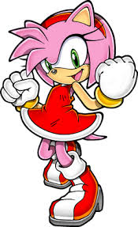
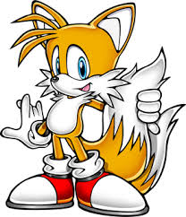

<html>
<html lang="en">
	<head>
		<meta charset="utf=8">
		<title>Green Hills| Advneture</title>
	</head>
	<link rel="stylesheet" type="text/css" href="css/one_page_website.css">
	<body>
		
		<!--NAV -->
		

			

				
				<a href= "#Home" id="link"><li>Home</li></a>
				<a href= "#https://youtu.be/G-i8HYi1QH0?si=HDkvWFJo9LvNfLpa">Green Hills Theme</A>
				<a href="#Gallery"><li>Gallery</li></a>
				<a href="#Ready to Spin"><li>Ready to Spin</li></a>
				
			

		

		<!-- End NAV -->
		
		<!-- Home -->
		

			

				

					<h1>Welcome to Green Hills</h1>
				

			

		

		<!-- End Home -->
		
		<!-- Gallery -->
		<section>
			

				<h1>Gallery</h1>
				

					
					<!-- Photo-Container 1 -->
					

						

							
							

								<h3>Sonic The Hedgehog</h3>
								
Welcome to Green Hills Choose Your Teammate!

							

						

					

					<!-- End Photo-container 1 -->
					
					<!-- Photo-Container 2 -->
					

						

							
							

								<h3>Shadow The Hedgehog</h3>
								
Welcome to the Green Hills Choose Your Teammate!

							

						

					

					<!-- End Photo-container 2 -->
					
					<!-- Photo-Container 3 -->
					

						

							
							

								<h3>Jet The Hawk</h3>
								
Welcome to the Green Hills Choose Your Teammate!

							

						

					

					<!-- End Photo-container 3 -->
					
					<!-- Photo-Container 4 -->
					

						

							
							

								<h3>Amy Rose</h3>
								
Welcome to the Green Hills Choose Your Teammate!

							

						

					

					<!-- End Photo-container 4 -->
					
					<!-- Photo-Container 5 -->
					

						

							
							

								<h3>Knuckles</h3>
								
Welcome to the Green Hills Choose Your Teammate!

							

						

					

					<!-- End Photo-container 5 -->
					
					<!-- Photo-Container 6 -->
					

						

							
							

								<h3>Tails</h3>
								
Welcome to the Green Hills Choose Your Teammate!

							

						

					

					<!-- End Photo-container 6 -->
								
				

			

		</section>
		 <!-- End Gallery -->
		 
		 <!-- Ready to Spin -->
		 <section>
			

				

					<h1>Ready to Spin in Green Hills!</h1>
					

						<h2>Your adventure is about to Spin.
							 If you are ready!
						</h2>
						

							Please provide your contact information
						

						

							<form action="" method="post">
								<input class="Ready to Spin" type="text" value="First Name">
								<input class="Ready to Spin" type="text" value="Last Name">
								<input class="Ready to Spin" type="text" value="Email Address">
								<input class="Ready to Spin" type="text" value="Phone Number">
								

									<label class="terms">Terms and Conditions</label>
								

								

									<input type="submit" value="Submit">
								

							</form>
						

					

				

			

		</section>
		<!-- End Ready to Spin -->
		
		<!-- Footer -->
		

			www.greenhills.spin &nbsp;|&nbsp; &copy; 2024
		

		<!-- End Footer -->
						
	</body>
</html>
	
